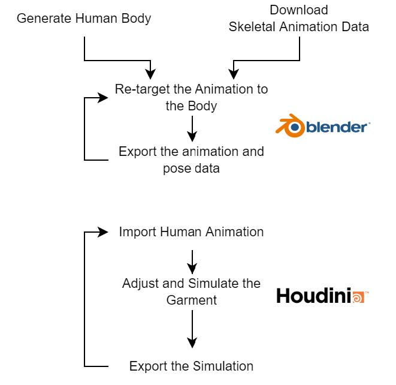
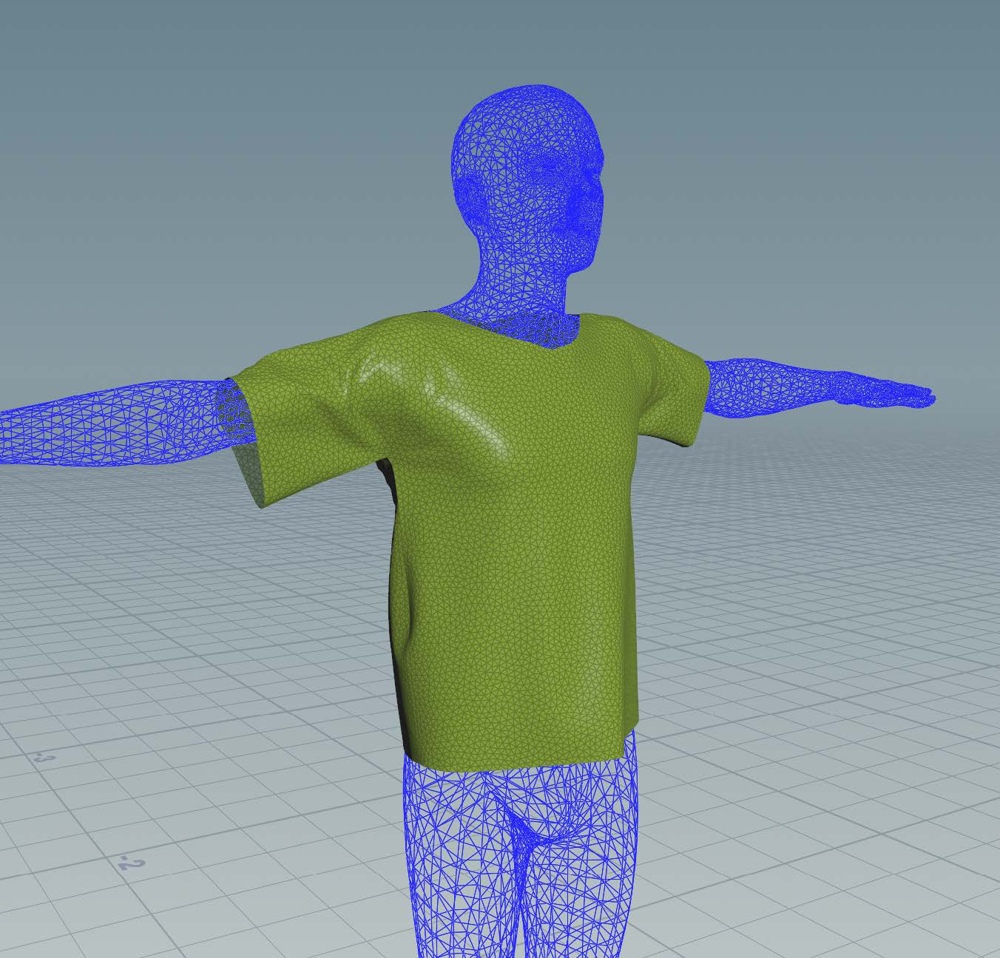
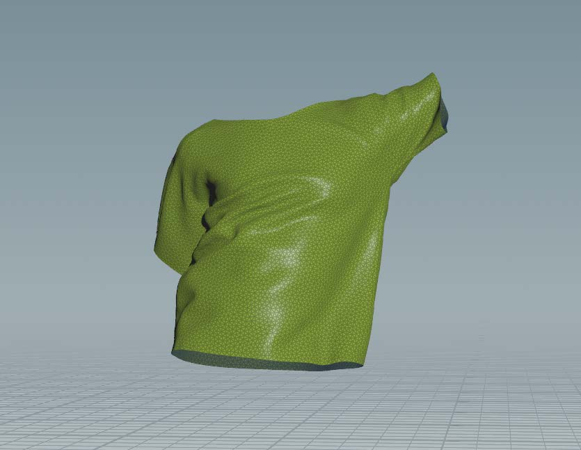

# Cloth Simulation Database, and Generation Toolset

This repository contains two scripts, for Blender and Houdini, that can generate an infinite number of Physics-Based Cloth Simulations intended to train Machine Learning Algorithms.

</img>

## Blender Script
The Blender script file loops over the process of:  (a) creating a random SMPL body shape;  (b) retargeting; and  (c) exporting the body and skeletal animation.    From each skeletal animation the script can create an infinite number of animated SMPL body shapes for each, male, female and neutral body types. So once the skeletal animation is set up in Blender, an infinite number of mesh animations can be generated.

## Houdini Script
The script in Houdini  (a) iterates over each folder (containing the animated SMPL mesh);  (b) loads the geometry,  (c) runs the simulation, and  (d) exports the cloth simulation to each respective folder.

</img>

</img>
</img>

## Dataset Overview

### Link to Database :
https://drive.google.com/drive/folders/15Pm41YiPCGp4vHTGhWTkBAL64DMXvs4E?usp=sharing
  The final dataset consists of 600 simulations, made up of 100 SMPL body shapes, in 6 animations.  The dataset was split into training, validation and test sets with 500, 20 and 80 simulations respectively.

## Naming Scheme
Each animation is saved to its own individual folder that uses the following naming scheme:

Skeletal Animation (3 digit) + index (4 digits) + Gender (1 digit)

Eg: 00110001.filetype

The number for the neutral, male and female gender are referred to as 0,1,2 respectively.
